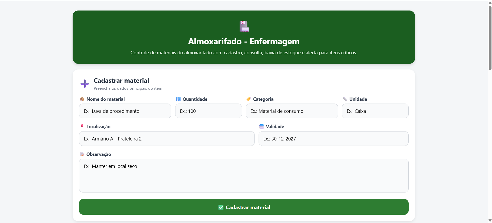
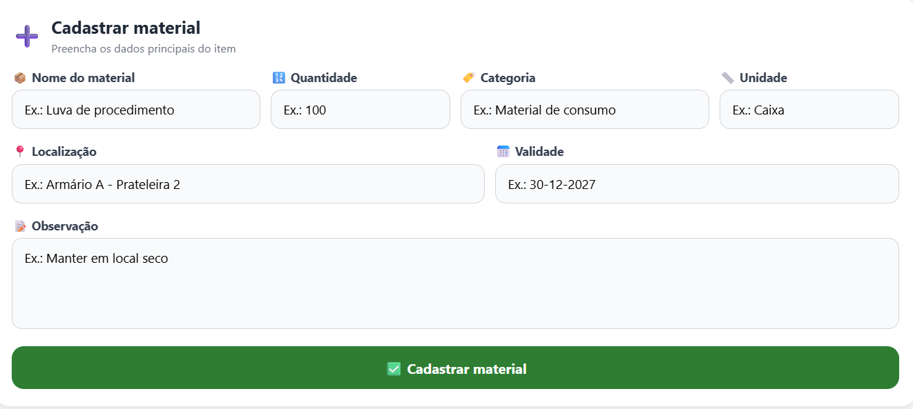
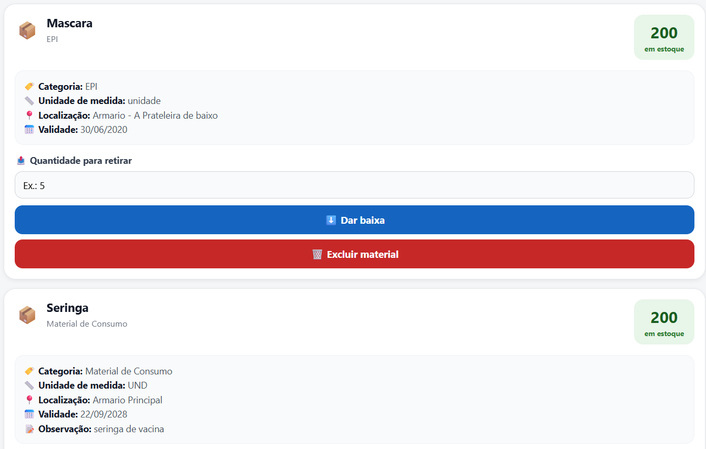
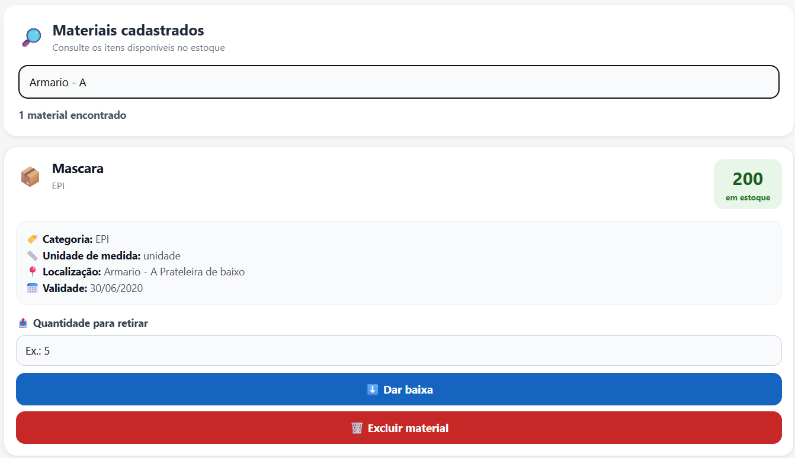
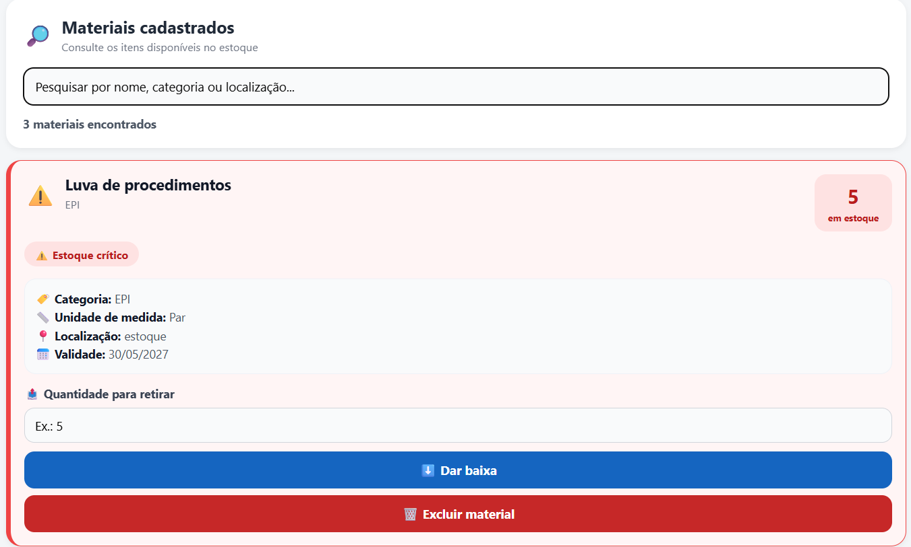

# Almoxarifado - Enfermagem

Aplicação multiplataforma desenvolvida com React Native e Expo para modernizar o controle dos materiais utilizados no almoxarifado das atividades práticas do curso de Enfermagem.

O sistema permite consultar o inventário, cadastrar materiais, pesquisar registros, realizar baixas no estoque e excluir itens. Os dados são armazenados em uma API simulada criada por meio da plataforma MockAPI.

A aplicação pode ser executada em dispositivos móveis com o Expo Go e também em navegadores por meio do Expo Web.

## Objetivo

Facilitar o registro e o controle dos materiais disponíveis no almoxarifado, reduzindo a necessidade de anotações em papel e atualizações manuais em planilhas.

A aplicação oferece uma alternativa simples, acessível e intuitiva para acompanhar o estoque, localizar materiais e registrar movimentações diretamente por dispositivos móveis ou navegadores.

## Funcionalidades implementadas

* Cadastro de materiais;
* Validação dos campos obrigatórios;
* Cadastro do nome do material;
* Cadastro da quantidade disponível;
* Cadastro da categoria;
* Cadastro da unidade de medida;
* Cadastro da localização;
* Cadastro opcional da data de validade;
* Cadastro opcional de observações;
* Formatação automática da validade no padrão `DD-MM-AAAA`;
* Conversão da validade para o formato ISO antes do envio à API;
* Consulta automática dos materiais ao iniciar a aplicação;
* Exibição dinâmica do inventário em uma lista;
* Atualização manual da lista ao puxá-la para baixo;
* Indicadores visuais durante as requisições;
* Limpeza automática do formulário após o cadastro;
* Pesquisa de materiais em tempo real;
* Pesquisa por nome, categoria, unidade de medida, localização ou observação;
* Pesquisa sem diferenciação entre letras maiúsculas, minúsculas e acentos;
* Totalizador de materiais encontrados;
* Destaque visual para materiais com estoque crítico;
* Exibição da quantidade disponível em um card de destaque;
* Baixa rápida de materiais diretamente pela lista;
* Validação da quantidade retirada;
* Bloqueio de retiradas iguais a zero;
* Bloqueio de retiradas negativas;
* Bloqueio de retiradas decimais;
* Bloqueio de retiradas superiores ao estoque disponível;
* Atualização do estoque na MockAPI utilizando requisição `PUT`;
* Atualização imediata da quantidade exibida na interface;
* Exclusão de materiais com confirmação do usuário;
* Exclusão permanente dos registros utilizando requisição `DELETE`;
* Atualização automática da lista depois de uma exclusão;
* Bloqueio de ações duplicadas durante as requisições;
* Tratamento de falhas de comunicação com a API;
* Mensagens amigáveis de erro;
* Botão para tentar carregar os materiais novamente;
* Interface responsiva para Web e dispositivos móveis;
* Testes unitários da função `validarRetirada` utilizando Jest.

## Regras de negócio

### Cadastro de materiais

Para cadastrar um material, devem ser informados:

* nome do material;
* quantidade atual;
* categoria;
* unidade de medida;
* localização.

A quantidade deve ser um número inteiro maior que zero.

A data de validade e a observação são opcionais. Quando informada, a data deve seguir o formato:

```text
DD-MM-AAAA
```

Exemplo:

```text
30-12-2027
```

Antes do envio à API, a data é convertida para o padrão ISO:

```text
2027-12-30T12:00:00.000Z
```

### Retirada de materiais

A retirada de um material somente é permitida quando:

* o estoque atual representa um número válido;
* a quantidade retirada representa um número inteiro;
* a quantidade retirada é maior que zero;
* a quantidade retirada é menor ou igual ao estoque disponível;
* a operação não resulta em estoque negativo.

A validação é realizada pela função pura exportada:

```js
validarRetirada(estoqueAtual, quantidadeRetirada)
```

Exemplos:

```js
validarRetirada(10, 5);  // true
validarRetirada(10, 10); // true
validarRetirada(5, 10);  // false
validarRetirada(10, 0);  // false
validarRetirada(10, -2); // false
```

A função também aceita valores numéricos recebidos como texto:

```js
validarRetirada("10", "4"); // true
```

### Estoque crítico

Um material é considerado em situação crítica quando sua quantidade disponível é menor que 10:

```js
Number(item.quantidadeAtual) < 10
```

Exemplos:

| Quantidade disponível | Situação        |
| --------------------: | --------------- |
|                     0 | Estoque crítico |
|                     5 | Estoque crítico |
|                     9 | Estoque crítico |
|                    10 | Estoque normal  |
|                   100 | Estoque normal  |

Quando o estoque está crítico, o cartão do material recebe destaque visual em vermelho e apresenta uma mensagem de alerta.

## Tecnologias utilizadas

* React Native;
* Expo;
* Expo Web;
* JavaScript;
* MockAPI;
* Fetch API;
* Jest;
* Git;
* GitHub.

## API utilizada

Endpoint utilizado para o gerenciamento dos materiais:

```text
https://6a18c6de23c3626470ac0536.mockapi.io/api/v1/materiais
```

### Estrutura de um material

```json
{
  "createdAt": "2026-06-24T12:00:00.000Z",
  "nome": "Luva de procedimento",
  "categoria": "EPI",
  "unidadeMedida": "Caixa",
  "quantidadeAtual": 100,
  "localizacao": "Armário A - Prateleira 2",
  "validade": "2027-12-30T12:00:00.000Z",
  "observacao": "Manter em local seco",
  "id": "1"
}
```

O campo `id` é gerado automaticamente pela MockAPI.

## Operações da API

### Buscar materiais

```http
GET /materiais
```

Busca todos os materiais cadastrados e preenche o inventário exibido pela aplicação.

### Cadastrar um material

```http
POST /materiais
```

Exemplo do corpo enviado:

```json
{
  "createdAt": "2026-06-24T12:00:00.000Z",
  "nome": "Luva de procedimento",
  "categoria": "EPI",
  "unidadeMedida": "Caixa",
  "quantidadeAtual": 100,
  "localizacao": "Armário A - Prateleira 2",
  "validade": "2027-12-30T12:00:00.000Z",
  "observacao": "Manter em local seco"
}
```

### Dar baixa no estoque

```http
PUT /materiais/:id
```

Atualiza o registro selecionado com a nova quantidade calculada.

Exemplo:

```text
Estoque atual: 100
Quantidade retirada: 20
Novo estoque: 80
```

Exemplo do material atualizado:

```json
{
  "nome": "Luva de procedimento",
  "categoria": "EPI",
  "unidadeMedida": "Caixa",
  "quantidadeAtual": 80,
  "localizacao": "Armário A - Prateleira 2",
  "validade": "2027-12-30T12:00:00.000Z",
  "observacao": "Manter em local seco"
}
```

### Excluir um material

```http
DELETE /materiais/:id
```

Remove permanentemente o material selecionado da MockAPI.

Antes da exclusão, o sistema solicita a confirmação do usuário. Depois da resposta positiva da API, o registro também é removido da lista exibida na aplicação.

## Pesquisa de materiais

A pesquisa é realizada em tempo real e permite localizar registros pelos seguintes dados:

* nome;
* categoria;
* unidade de medida;
* localização;
* observação.

A pesquisa ignora letras maiúsculas, minúsculas e acentos.

Por exemplo, uma pesquisa pelo termo:

```text
armario
```

também encontra um material localizado em:

```text
Armário A - Prateleira 2
```

O totalizador é atualizado automaticamente de acordo com a quantidade de resultados encontrados.

## Identificadores obrigatórios

### Sprint 1

| Componente          | Identificador               |
| ------------------- | --------------------------- |
| Campo do nome       | `testID="input-nome"`       |
| Campo da quantidade | `testID="input-quantidade"` |
| Botão de cadastro   | `testID="btn-cadastrar"`    |
| Lista de materiais  | `testID="lista-materiais"`  |

### Sprint 2

| Componente                   | Identificador             |
| ---------------------------- | ------------------------- |
| Campo da quantidade retirada | `testID="input-retirada"` |
| Botão de baixa               | `testID="btn-baixar"`     |
| Botão de exclusão            | `testID="btn-excluir"`    |

### Sprint 3

| Componente                   | Identificador                          |
| ---------------------------- | -------------------------------------- |
| Campo de pesquisa            | `testID="input-busca"`                 |
| Totalizador de materiais     | `testID="total-itens"`                 |
| Material com estoque crítico | `accessibilityLabel="estoque-critico"` |

## Demonstração do sistema

Nesta seção são apresentadas as principais telas e funcionalidades do sistema de controle de materiais do almoxarifado do curso de Enfermagem.

### Tela inicial

A tela inicial apresenta a identificação do sistema e o formulário utilizado para cadastrar novos materiais.

<p align="center">
  
</p>

### Cadastro de material

O formulário permite registrar nome, quantidade, categoria, unidade de medida, localização, data de validade e uma observação opcional.

<p align="center">
  
</p>

### Lista de materiais cadastrados

Os materiais recuperados da API são apresentados em cartões. Cada cartão exibe os dados do material e destaca a quantidade disponível no canto direito.

<p align="center">
  
</p>

### Pesquisa em tempo real

O campo de pesquisa permite localizar materiais por nome, categoria, unidade de medida, localização ou observação. O totalizador é atualizado automaticamente.

<p align="center">
  
</p>

### Alerta de estoque crítico

Quando a quantidade disponível é menor que 10, o cartão recebe destaque visual em vermelho e apresenta o aviso de estoque crítico.

<p align="center">
  
</p>

## Testes unitários

Os testes unitários verificam as regras da função pura `validarRetirada`.

O arquivo de testes está localizado em:

```text
__tests__/validarRetirada.test.js
```

Os testes verificam:

* retirada menor que o estoque;
* retirada de todo o estoque disponível;
* valores numéricos recebidos como texto;
* retirada superior ao estoque;
* quantidade negativa;
* retirada igual a zero;
* quantidade decimal;
* texto que não representa um número;
* retirada quando o estoque está zerado;
* utilização de estoque atual negativo.

Para executar todos os testes:

```bash
npm test
```

Para executar os testes sequencialmente:

```bash
npm test -- --runInBand
```

Para executar somente o teste da retirada:

```bash
npm test -- validarRetirada.test.js
```

## Como executar o projeto

### Pré-requisitos

Antes de iniciar, é necessário instalar:

* Node.js;
* npm;
* Expo Go em um dispositivo móvel ou um emulador Android/iOS.

### Instalação

Clone o repositório:

```bash
git clone URL_DO_SEU_REPOSITORIO
```

Entre na pasta do projeto:

```bash
cd NOME_DA_PASTA
```

Instale as dependências:

```bash
npm install
```

Inicie o servidor de desenvolvimento:

```bash
npx expo start
```

Depois, escaneie o QR Code exibido no terminal utilizando o Expo Go.

### Executar no navegador

Com o servidor do Expo aberto, pressione:

```text
w
```

Também é possível executar diretamente com:

```bash
npx expo start --web
```

### Limpar o cache

Para iniciar o projeto limpando o cache:

```bash
npx expo start -c
```

## Estrutura principal do projeto

```text
almoxarifado-enfermagem/
├── __tests__/
│   └── validarRetirada.test.js
├── assets/
│   └── screenshots/
│       ├── tela-inicial-web.png
│       ├── formulario-cadastro.png
│       ├── lista-materiais.png
│       ├── pesquisa-material.png
│       └── estoque-critico.png
├── App.js
├── README.md
├── app.json
├── package.json
└── package-lock.json
```

## Tratamento de erros

As operações de consulta, cadastro, baixa e exclusão são protegidas por blocos `try/catch`.

Quando uma falha de comunicação acontece, a aplicação:

* registra o erro técnico no console;
* apresenta uma mensagem amigável ao usuário;
* evita a exibição direta de mensagens técnicas;
* disponibiliza uma nova tentativa de carregamento;
* encerra corretamente os indicadores de carregamento.

## Próximas etapas planejadas

* Registro detalhado do histórico de movimentações;
* Identificação do instrutor responsável por cada retirada;
* Alertas de validade próxima;
* Filtro específico por categoria;
* Registro de entradas de materiais;
* Relatórios de entradas e saídas;
* Exportação do inventário;
* Estratégia de funcionamento temporário sem internet;
* Controle de diferentes níveis de acesso.

## Autor

Projeto acadêmico desenvolvido por **Rogher Adriano Soares**.
